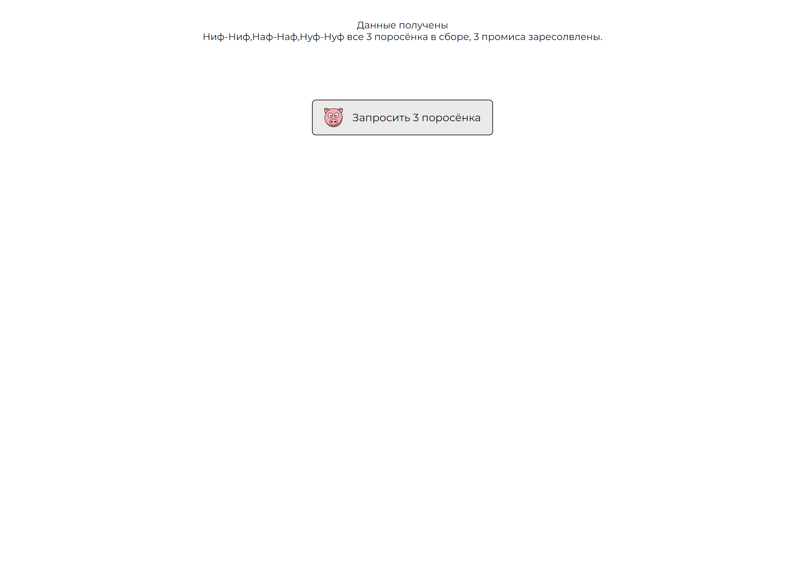

### Задание

1. Сделайте 3 POST запроса к серверу.
   - пример backend:
   (backend_1.php sleep(5);)
   (backend_2.php sleep(15);)
   (backend_2.php sleep(10);)

2. После выполнения всех трёх запросов необходимо на JavaScript
   запустить функцию-индикатор о завершении всех запросов.
   (проще говоря: заресолвить 3 промиса)

### Дополнительно выполнено

- вывод сообщений о совершении операции

### Запуск сервера

php -S localhost:8000

 

