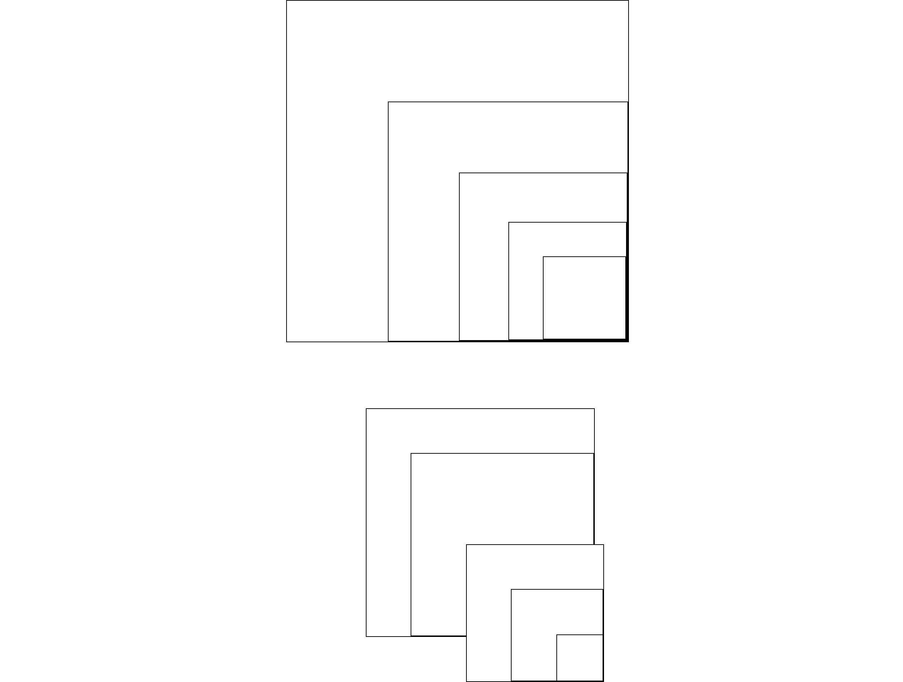
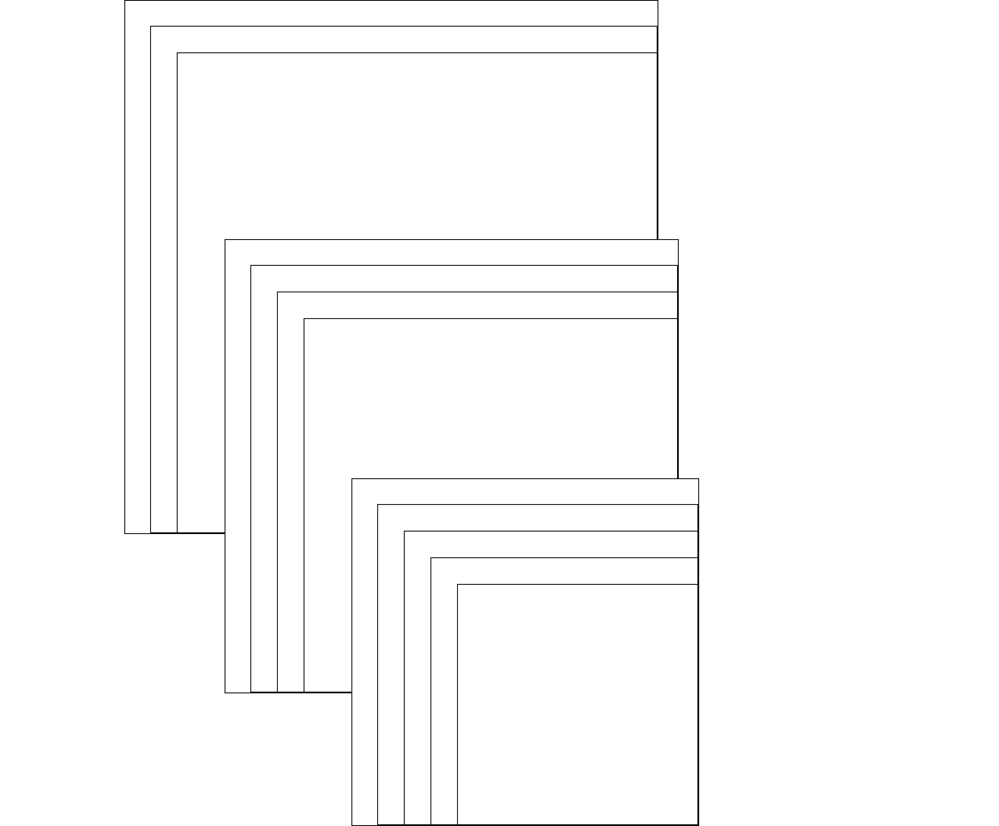

### Задание

1. Есть div контейнер, внутри него может быть неограниченное кол-во
   вложенных div контейнеров.

2. Напишите CSS таким образом, что бы div контейнеры отображались
   как на образце, (пример на скриншоте ниже).

 

