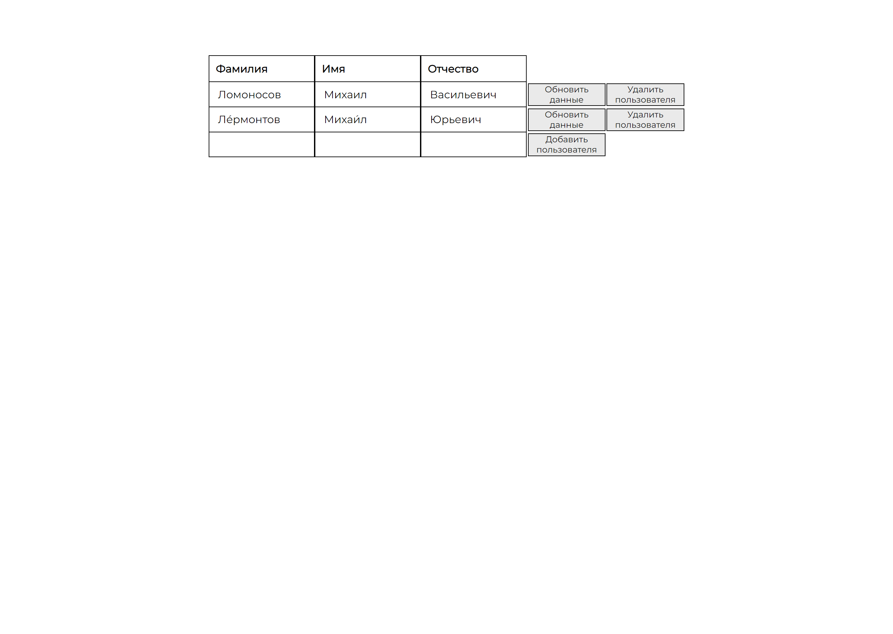

### Задание

1. Создайте таблицу клиентов с полями Фамилия, Имя, Отчество в базе данных.

2. Под таблицей разместите 3 поля для ввода Фамилия, Имя, Отчество.

3. Под полями разместите кнопки "Добавить", "Изменить", "Удалить".

4. Необходимо создать события для добавления записей в таблицу,
   изменения и удаления.

5. Необходимо предотвратить дублирование одинаковых ФИО в таблице.

6. Стек технологий: JavaScript, PhP, MySQL.

7. Для обращения к backend используйте FetchAPI.

8. Необходимо на серверной стороне создайть таблицу клиентов и
   написать класс с методами обработки вызываемых событий,
   ответы должны приходить в JSON формате.

9. Страница не должна перезагружаться.

### Дополнительно выполнено

- вывод сообщений о валидации и совершении операции

### Запуск сервера

php -S localhost:8000

 

